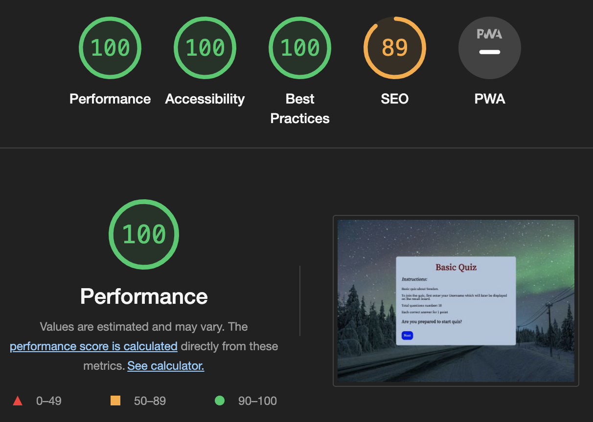

# Basic Quiz Application
This is an basic quiz test application about Sweden and built on HTML, CSS and JavaScript. There are 10 functions in this file.

Function with the largest signature take 2 arguments, while the median is 0.

Largest function has 11 statements in it, while the median is 5.5.

The most complex function has a cyclomatic complexity value of 3 while the median is 1.

There are all screen size tested and screenshots under below.

## Instruction
All instruction large on the main page. Question number is 10 and there are four four possible answer. Before starting the quiz, you have to enter User name. Scoring system and more..

## Features
- This site offers quiz about Swedish general knowledge.
- There are four choice option with each question.
- A user may enter a username to add the screen message.
- The site is fully responsive design.
- Interactive elements.

## Testing
- index.html tested with W3School HTML validation.
- style.css tested with W3School CSS validation.
- script.js tested with JShint validation.

## Starting the Quiz
Each question is displayed with four possible answers. All answer is button based. 

When the user click the options button(a possible answer) the submit answer direct. An appropriate message is display for right or wrong answer.

The application tracks the score for the current quiz category and the overall score across all categories in the result board area.

## Acessibility
Lighthouse showed an accessibility score of 100.

## unfixed Bugs
None

## Deployment
The site was deployed to GitHub pages. The steps to deploy are as follows:

In the GitHub repository, navigate to the Settings tab
Click on 'Pages' in the menu on the left.
From the source section drop-down menu, select the Main Branch.
Press the 'Save' button.
Once the main branch has been selected, the page will be automatically refreshed with a detailed ribbon display to indicate the successful deployment.
(github) The live link is: https://github.com/mamuzaan/Portfolio-Project2-Quiz

Gitpod live link is: https://mamuzaan.github.io/Portfolio-Project2-Quiz/

## Credits
- Content was taken from google search
- Mentor support 
- W3School 
